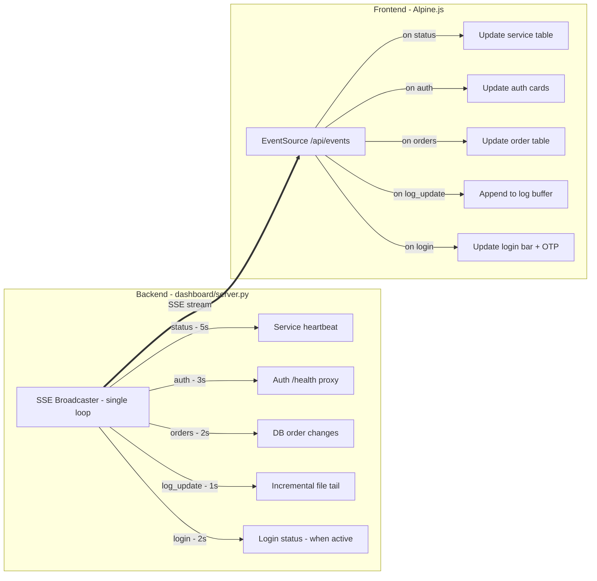

# Plan: Dashboard Refactoring — True Real-time + Better UI

**Created**: 2026-06-13 07:05 +07  
**Status**: DRAFT — awaiting user approval

---

## Goal

Refactor the BotPasteDon dashboard to achieve **true real-time updates** across all data
types (services, auth, orders, logs, login flow) via expanded SSE, and deliver a
**significantly better UI/UX** using Alpine.js reactivity and polished CSS.

---

## Current Problems

### Real-time gaps

| Data | Current Method | Interval | Real-time? |
|------|---------------|----------|-----------|
| Service status | SSE push | 5s | ✅ slow |
| Auth JWT/cookies | REST poll | 8s | ❌ |
| Profile status | REST poll | 10s | ❌ |
| Orders | REST poll | manual | ❌ |
| Logs | REST poll full re-fetch | 5s | ❌ |
| Login flow | REST poll | 2s | ⚠️ |

### UI issues
- Monolithic 460-line HTML with inline CSS + JS — hard to maintain
- No reactive data binding — all DOM updates manual
- No loading states, no transition animations
- No connection status indicator
- Log viewer re-fetches 200 lines every 5s — wasteful, loses scroll
- Orders table never auto-refreshes

---

## Architecture Decision



**Key choices:**
- **Keep SSE** (not WebSocket) — unidirectional is sufficient, auto-reconnect built-in
- **Alpine.js via CDN** (~14KB) — reactive data binding, no build step, no npm
- **Single HTML file** — consistent with project style, internal tool
- **No new Python dependencies** — `aiohttp_sse` already in requirements

---

## Allowed Files

| File | What changes |
|------|-------------|
| `dashboard/server.py` | Expand SSE broadcaster, add incremental log reader, add order change detection |
| `dashboard/templates/index.html` | Full rewrite with Alpine.js + polished CSS |
| `shared/constants.py` | May need to add order states list if not already there (read-only check) |

## Do Not Touch

- `shared/database.py` — no schema changes needed
- `auth/main.py` — auth service unchanged
- All other services: scanners, workers, coordinator, status_sync
- `shared/config.py`, `.env`, deploy configs

---

## Steps

### Step 1 — Backend: Add incremental log file reader

File: `dashboard/server.py`

- Add `_log_positions: dict[str, int]` — tracks byte offset per log file
- Add `_read_new_lines(path: str, name: str) -> list[str]`:
  - Open file, seek to `_log_positions[name]` or 0
  - Read new lines, update position
  - Handle log rotation (if file shrunk, reset to 0 and read all)
  - Return list of new lines

### Step 2 — Backend: Add order change detection

File: `dashboard/server.py`

- Add `_last_order_check: float` timestamp
- Every 2s in broadcaster:
  - `SELECT order_id, platform, status, item_name, quantity, character, customer_name, created_at, updated_at FROM orders WHERE updated_at > ? ORDER BY created_at DESC LIMIT 50`
  - Compare with previous snapshot to detect changes
  - Emit `orders` event with `{orders: [...], total: N}`

### Step 3 — Backend: Expand SSE broadcaster to handle all event types

File: `dashboard/server.py`

Refactor `_sse_broadcaster()` into a combined loop with sub-intervals:

```
Cycle every 1s:
  tick++
  if tick % 1 == 0:  check log files → emit log_update per file with new lines
  if tick % 2 == 0:  check order changes → emit orders
  if tick % 2 == 0 and login_active: check login status → emit login
  if tick % 3 == 0:  proxy /health → emit auth (g2g + eldo freshness)
  if tick % 5 == 0:  read heartbeat → emit status (existing logic)
```

SSE event format:
- `event: status` — `{services: [...], stale_count: N}`
- `event: auth` — `{g2g: {...}, eldo: {...}}` (same shape as `/api/auth-status`)
- `event: orders` — `{orders: [...], total: N, offset: 0, limit: 50}`
- `event: log_update` — `{name: "auth", lines: ["new line 1", "new line 2"]}`
- `event: login` — `{status: "need_otp"|"logging_in"|"success"|"failed", message: "..."}`

Keep all existing REST endpoints — they serve as initial data load on page open.

### Step 4 — Backend: Add initial data endpoint for SSE clients

File: `dashboard/server.py`

- Modify `handle_sse` to send initial data burst on connect:
  - Send current status, auth, and orders as first events
  - This ensures new clients get immediate data before next broadcast cycle

### Step 5 — Frontend: Restructure with Alpine.js

File: `dashboard/templates/index.html`

- Add Alpine.js CDN: `<script defer src="https://cdn.jsdelivr.net/npm/alpinejs@3/dist/cdn.min.js"></script>`
- Convert all data to Alpine.js reactive properties:

```javascript
function dashboard() {
  return {
    // State
    connected: false,
    services: [],
    auth: { g2g: {}, eldo: {} },
    orders: [],
    orderTotal: 0,
    orderOffset: 0,
    logBuffers: {},        // { auth: [...], g2g_worker: [...], ... }
    activeLog: 'auth',
    loginStatus: null,
    loginActive: false,
    otpModalOpen: false,
    otpCode: '',
    activeTab: 'overview',
    staleCount: 0,
    
    init() {
      this.connectSSE();
      this.fetchInitialData();
    },
    
    connectSSE() { ... },
    fetchInitialData() { ... },
    // ... methods
  }
}
```

- **Remove ALL `setInterval()` polling** — everything comes through SSE
- Keep REST calls only for: initial page load, user actions (OTP submit, auto-login, pagination)

### Step 6 — Frontend: UI polish with improved CSS

File: `dashboard/templates/index.html`

Visual improvements while keeping the dark theme:

1. **Connection indicator**: Green/red dot in header showing SSE connection state
2. **Auth cards**: Add JWT expiry progress bar (visual countdown)
3. **Service table**: Pulse animation on status changes, better dot indicators
4. **Order table**: Status badges with subtle glow, auto-update highlight flash
5. **Log viewer**: 
   - Level filter buttons (ALL / INFO / WARN / ERROR)
   - Line count indicator
   - Auto-scroll toggle
   - Better monospace font rendering
6. **OTP modal**: Smoother open/close animation, auto-focus improvement
7. **General**:
   - Transition animations on data updates (subtle highlight flash)
   - Better spacing and card borders
   - Loading skeleton for initial data
   - Responsive improvements for mobile

### Step 7 — Verify and deploy

- `python -c "import py_compile; py_compile.compile('dashboard/server.py', doraise=True); print('OK')"`
- Test locally or deploy to `.220`
- Verify all SSE events flow correctly
- Verify log streaming is incremental (check browser Network tab)
- Verify UI renders properly in Chrome

---

## Acceptance Criteria

1. **No more REST polling** — browser DevTools Network tab shows zero periodic XHR, only SSE stream
2. **All data updates via SSE** — services, auth, orders, logs, login all push-driven
3. **Logs stream incrementally** — no full re-fetch, new lines append only
4. **Orders auto-update** — new orders and status changes appear within 2s
5. **Auth status real-time** — JWT expiry countdown updates every 3s
6. **UI looks polished** — clean dark theme, smooth transitions, connection indicator
7. **Alpine.js reactive** — all DOM updates via Alpine bindings, zero manual innerHTML
8. **Zero new Python dependencies** — only CDN-loaded Alpine.js added

---

## Sensitive Areas

- **Opus review needed: NO** — dashboard is read-only monitoring, no auth/DB schema/webhook/coordinator logic
- Does not touch any sensitive files listed in AGENTS.md
- Only reads from `heartbeat` and `orders` tables (existing queries, no schema change)

---

## Risks

| Risk | Mitigation |
|------|-----------|
| Alpine.js CDN unavailable on bot server (no internet) | Download alpine.min.js and serve locally from `dashboard/static/` |
| SSE connection drops | Alpine.js auto-reconnects EventSource + visual indicator |
| Log files rotate while reading | `_read_new_lines` detects file shrink → reset position |
| Too many SSE events overwhelm browser | Throttle to max 10 events/second, batch log lines |
| Large order list performance | Only push changed orders (delta), keep client-side buffer |
| Alpine.js learning curve | Minimal — just `x-data`, `x-text`, `x-for`, `x-if`, `x-on` |
